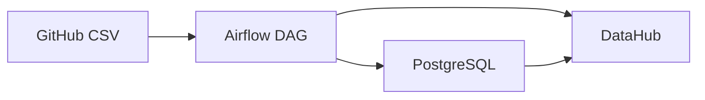

# DataHub Metadata Ingestion Pipeline

This repository contains an Airflow-based ETL pipeline that processes employee data and ingests metadata into DataHub. The pipeline demonstrates how to integrate PostgreSQL with DataHub for metadata management.

## Architecture Overview



## Prerequisites

- Apache Airflow
- PostgreSQL
- DataHub instance
- Python 3.8+

## Dependencies

The following Python packages are required:

```bash
pip install -r requirements.txt
```

Key dependencies include:
- `apache-airflow`
- `datahub-emitter`
- `pandas`
- `psycopg2-binary`
- `sqlalchemy`
- `requests`

## Project Structure

```
.
├── dags/
│   └── etl_pipeline_dag.py    # Main Airflow DAG file
├── requirements.txt           # Python dependencies
└── README.md                 # This file
```

## DataHub Integration

### Configuration

The pipeline uses the following DataHub configuration:
- GMS Endpoint: `http://datahub-gms:8080`
- Dataset URN: `urn:li:dataset:(urn:li:dataPlatform:postgres,etl_pipeline.employees,PROD)`

### Metadata Aspects

The pipeline emits the following metadata aspects to DataHub:

1. **Dataset Properties**
   - Description
   - Custom properties (pipeline, team, update frequency)

2. **Schema Metadata**
   - Field definitions
   - Data types
   - Field descriptions

3. **Ownership**
   - Data owner information
   - Ownership type

## ETL Pipeline Workflow

The Airflow DAG (`etl_pipeline_dag.py`) implements the following workflow:

1. **Download CSV**
   - Downloads employee data from GitHub
   - Source: `https://raw.githubusercontent.com/Subashkhanal2580/metadata_test/main/employee_data.csv`

2. **Transform Data**
   - Cleans and transforms the data
   - Handles missing values
   - Validates data types

3. **Load to PostgreSQL**
   - Creates employees table if not exists
   - Loads transformed data
   - Schema: `id`, `age`, `name`, `salary`

4. **Emit Metadata to DataHub**
   - Sends dataset properties
   - Emits schema metadata
   - Updates ownership information

## Implementation Details

### PostgreSQL Schema

```sql
CREATE TABLE employees (
    id INTEGER PRIMARY KEY,
    age INTEGER,
    name VARCHAR(255),
    salary DECIMAL(10, 2)
)
```

### DataHub Metadata Schema

```json
{
    "fields": [
        {
            "fieldPath": "id",
            "description": "Employee ID",
            "type": {"type": {"com.linkedin.schema.NumberType": {}}},
            "nativeDataType": "INTEGER"
        },
        {
            "fieldPath": "name",
            "description": "Employee Name",
            "type": {"type": {"com.linkedin.schema.StringType": {}}},
            "nativeDataType": "VARCHAR"
        },
        {
            "fieldPath": "department",
            "description": "Employee Department",
            "type": {"type": {"com.linkedin.schema.StringType": {}}},
            "nativeDataType": "VARCHAR"
        }
    ]
}
```

## Setup Instructions

1. **Install Dependencies**
   ```bash
   pip install -r requirements.txt
   ```

2. **Configure Airflow**
   - Set up Airflow environment variables
   - Configure PostgreSQL connection
   - Ensure DataHub GMS endpoint is accessible

3. **Deploy DAG**
   - Copy `etl_pipeline_dag.py` to Airflow DAGs folder
   - Restart Airflow webserver and scheduler

4. **Run Pipeline**
   - Trigger the DAG manually or wait for scheduled execution
   - Monitor execution in Airflow UI

## Monitoring and Maintenance

- Check Airflow logs for pipeline execution status
- Monitor DataHub UI for metadata updates
- Verify data consistency between PostgreSQL and DataHub

## Security Considerations

- The current implementation assumes an open DataHub GMS endpoint
- Consider implementing authentication for production use
- Secure sensitive information in Airflow connections

## Future Improvements

1. **Enhanced Metadata**
   - Add data lineage information
   - Include data quality metrics
   - Add glossary terms and tags

2. **Security**
   - Implement DataHub authentication
   - Add data encryption
   - Secure API endpoints

3. **Monitoring**
   - Add data quality checks
   - Implement alerting
   - Track metadata changes

## Troubleshooting

Common issues and solutions:

1. **DataHub Connection Issues**
   - Verify GMS endpoint accessibility
   - Check network connectivity
   - Validate URN format

2. **PostgreSQL Connection Errors**
   - Verify connection string
   - Check database permissions
   - Ensure table exists

3. **Data Transformation Issues**
   - Validate input data format
   - Check data type conversions
   - Monitor missing value handling

## Contributing

1. Fork the repository
2. Create a feature branch
3. Commit your changes
4. Push to the branch
5. Create a Pull Request

## License

This project is licensed under the MIT License - see the LICENSE file for details. 